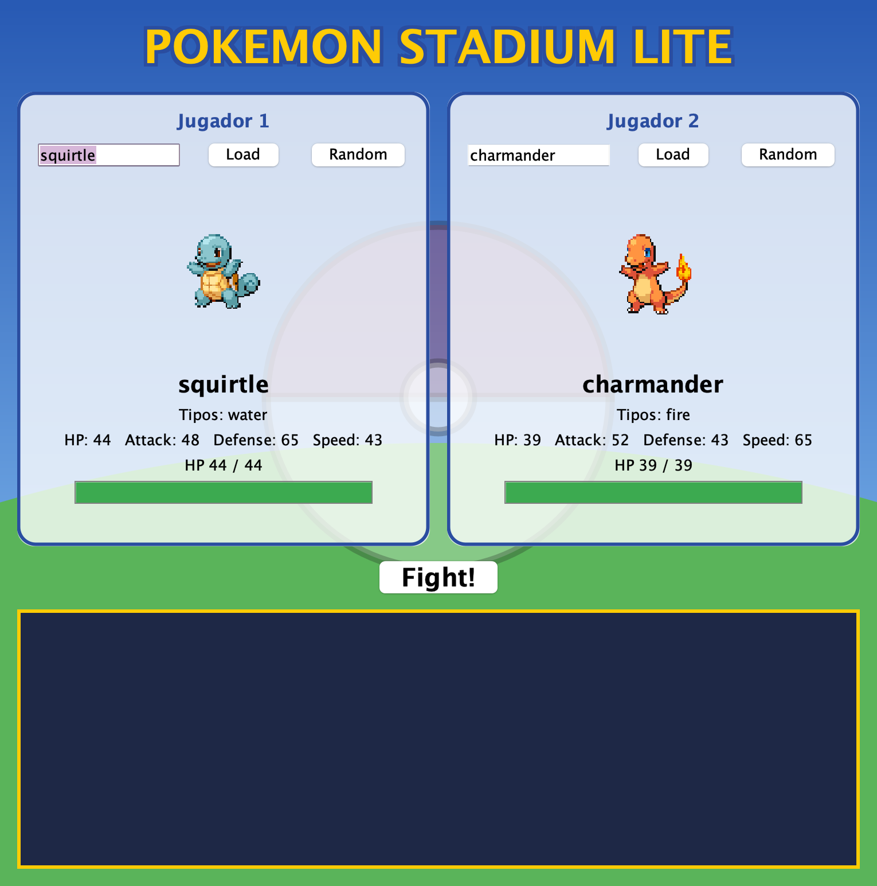
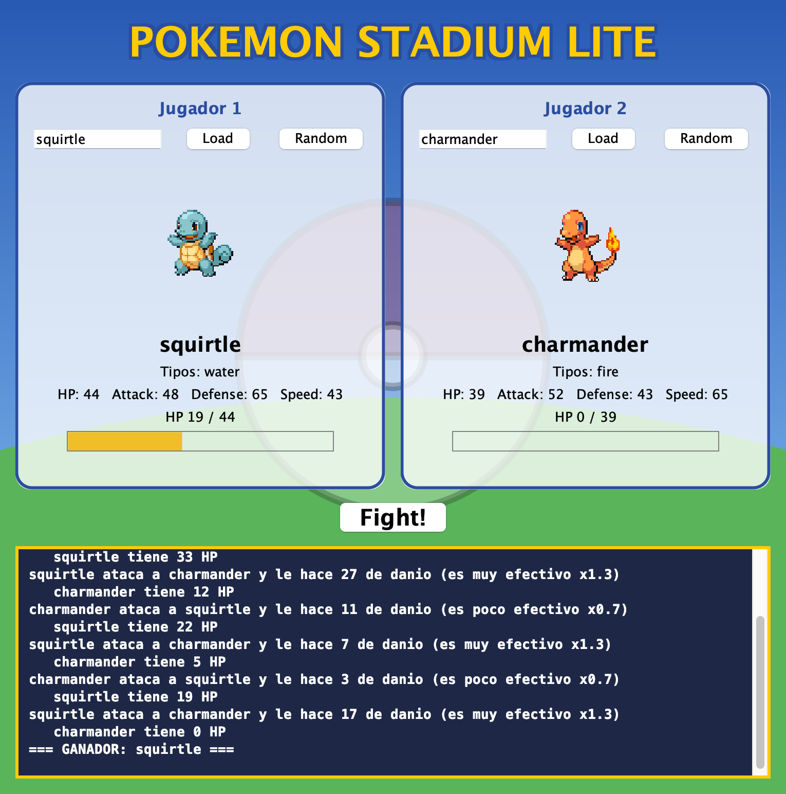
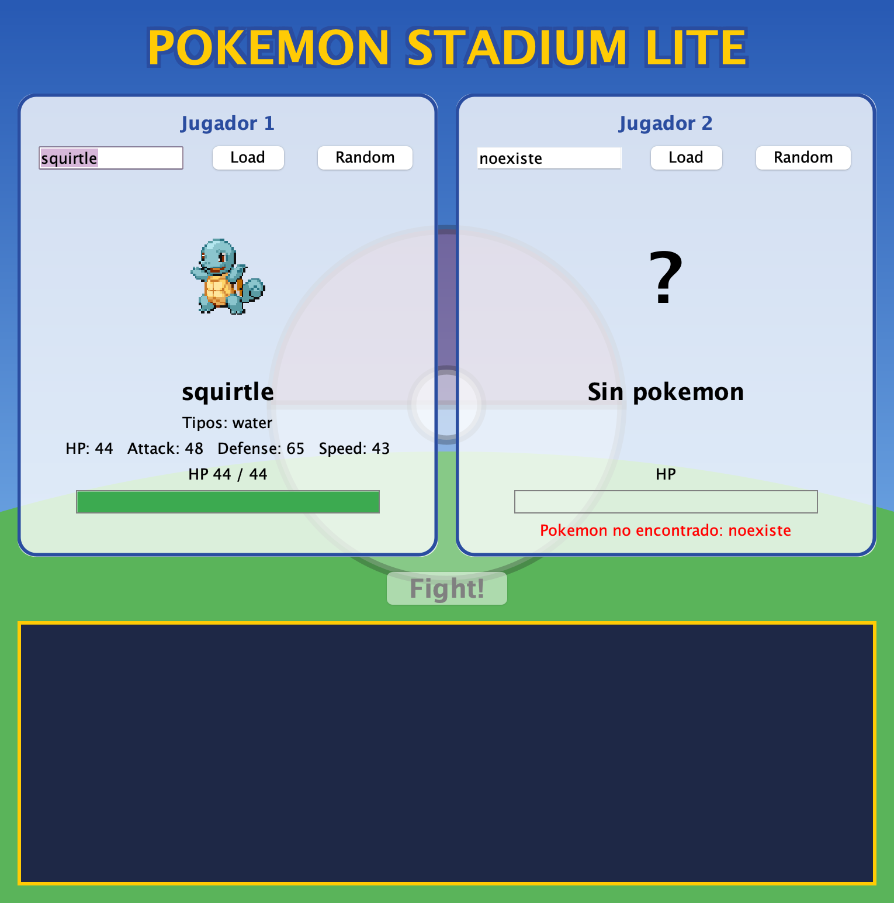

# Pokémon Stadium Lite

Taller de Desarrollo de Software III. Es una aplicación de escritorio en Java Swing que trae dos Pokémon desde [PokeAPI](https://pokeapi.co/) y los pone a pelear por turnos, mostrando la vida de cada uno y un log con todo lo que pasa.

## Cómo ejecutar

Se necesita IntelliJ IDEA y Java 11 o superior. La única librería externa es `org.json`, que ya viene en la carpeta `lib`.

1. Abrir la carpeta del proyecto en IntelliJ.
2. Abrir `src/stadium/Main.java` y ejecutarla con el triángulo verde que aparece junto al método `main`.

La interfaz está hecha con el diseñador de IntelliJ (archivos `.form`), por eso el proyecto se ejecuta desde IntelliJ y no desde la terminal.

## Cómo se usa

1. En cada lado se elige un Pokémon: escribiendo el nombre y dando clic en **Load**, o con **Random**.
2. Cuando los dos lados tienen Pokémon se activa el botón **Fight!**.
3. El combate avanza solo, turno por turno, hasta que uno llega a 0 de HP.

## Diseño

El código está separado en cuatro paquetes, cada uno con una sola responsabilidad. `modelo` tiene la clase `Pokemon`, que guarda los datos y el HP actual. `api` tiene `PokeApiClient`, que hace la petición con `HttpClient` y convierte el JSON en un `Pokemon`. `batalla` tiene `Battle`, con las reglas del combate, y la interfaz `BattleListener`. `ui` tiene la ventana (`VentanaBatalla`) y el panel de cada jugador (`PanelPokemon`), los dos diseñados con el diseñador de IntelliJ (`.form`). El panel de jugador se diseña una sola vez y la ventana lo usa dos veces. El fondo del estadio (`PanelFondo`) y la tarjeta de cada jugador (`PanelTarjeta`) se dibujan con `Graphics2D` y se conectan al diseñador con `createUIComponents`.

La clase `Battle` no sabe nada de Swing: cada vez que pasa algo avisa por medio del `BattleListener` (`onBattleStarted`, `onTurn`, `onHpChanged`, `onBattleEnded`). La ventana implementa esa interfaz y solo cambia la barra de vida y el log cuando le llega uno de esos eventos. Para no congelar la ventana, las peticiones a la API y el combate corren en un hilo aparte (`Thread`), y cuando hay que tocar un componente de Swing se usa `SwingUtilities.invokeLater` para volver al hilo de la interfaz.

```
src/stadium
├── Main.java
├── modelo/Pokemon.java
├── api/PokeApiClient.java
├── batalla/Battle.java
├── batalla/BattleListener.java
└── ui
    ├── VentanaBatalla.java + VentanaBatalla.form
    ├── PanelPokemon.java + PanelPokemon.form
    ├── PanelFondo.java
    └── PanelTarjeta.java
```

## Reglas del combate

- **Orden:** empieza el que tenga más Speed. Si empatan se decide al azar.
- **Daño:**

  ```
  fuerza  = ATK * random(0.5 a 1.0)
  bloqueo = DEF * random(0.0 a 0.5)
  daño    = (fuerza - bloqueo) / 2
  ```

  Se eligió así porque con la fórmula sugerida (`ATK*random(0-1) - DEF*random(0-1)`) el daño sale negativo muchas veces. Con estos rangos el ataque siempre pega al menos la mitad y la defensa frena como mucho la mitad. Se divide en 2 para que el combate dure varios turnos, y el daño mínimo es 1 para que la pelea siempre termine.
- **Crítico:** 10 % de probabilidad, multiplica el daño por 1.5.
- **Efectividad** (solo con el primer tipo): agua > fuego, fuego > planta, planta > agua. Si le gana multiplica por 1.3, si pierde por 0.7, y en el resto de casos por 1.0.
- El HP nunca baja de 0.

## Errores

Si el Pokémon no existe o no hay internet, el mensaje aparece en rojo en el panel de ese jugador y la ventana sigue funcionando. El botón **Fight!** no se activa hasta que los dos Pokémon se carguen bien.

## Capturas

Pokémon cargados:



Combate terminado:



Error cuando el Pokémon no existe:


